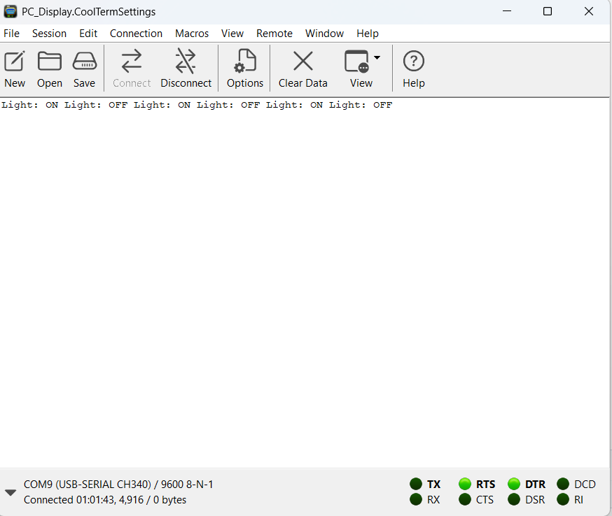

#  Smart Control and Monitoring System

A smart system designed to **control and monitor room lighting** both manually and automatically.  
It uses an **IR sensor** for automatic light switching when entering or leaving the room,  
a **Button (via EXTI)** for manual operation, and provides **real-time feedback** on an **LCD** and a **PC interface** via **UART communication**.

---

## ⚙️ Hardware Components

- **STM32F103C8T6** (Microcontroller)
- **16x2 LCD Display**
- **IR Sensor** (for automatic light detection)
- **Push Button** (manual control via EXTI)
- **Relay Module** (to switch the light)
- **USB to TTL Converter** (for UART communication with PC)
- **ST-LINK/V2** (for programming and debugging)

---

## 🧰 Software & Tools
- **STM32CubeIDE** – for coding, compiling, and debugging  
- **CoolTerm** – for UART monitoring on PC  
- **Programming Language:** C  
- **Embedded Layers:**
  - **MCAL:** GPIO, RCC, EXTI, UART drivers  
  - **HAL:** LCD, IR, Light Control, PC Display  
  - **APP:** System initialization and operation logic  

---

## 🎬 Demo Video
Here’s a short demo showing the system in action:  

🎥 [Watch the demo on YouTube](https://youtu.be/uubYdVKIsu8)

---

## 🖼️ Take a Quick look 

<p align="left">
  
</p>

---

## 🧩 System Architecture
```plaintext
Project Root
│
├── main.c
│
├── MCAL
│   ├── GPIO
│   ├── RCC
│   ├── UART
│   └── EXTI
│
├── HAL
│   ├── LCD
│   ├── IR
│   ├── Light
│   └── PC_Display
│
└── Application
    ├── SACS.c
    └── SACS.h

---
